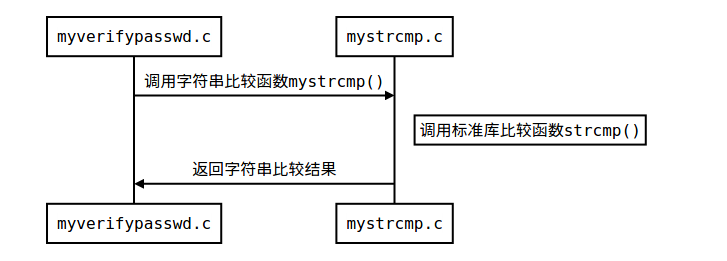
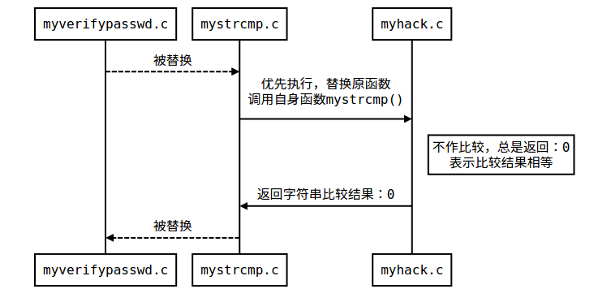

# rootkit   HOOK技术
深入浅出rootkit

## LD_PRELOAD 
> LD_PRELOAD是Linux系统的一个环境变量  允许你定义在程序运行前优先加载的动态链接库  我们可以在主程序和其动态链接库的中间加载别的动态链接库，甚至覆盖正常的函数库。   
从而达到注入的目的

### Linux程序执行流程图
正常流程:

当发生了LD_PRELOAD 替换

### 文件
- Demo1  简单利用演示
- Demo2  loadable kernel module rootkit(LKM rootkit)  内核rootkit演示
